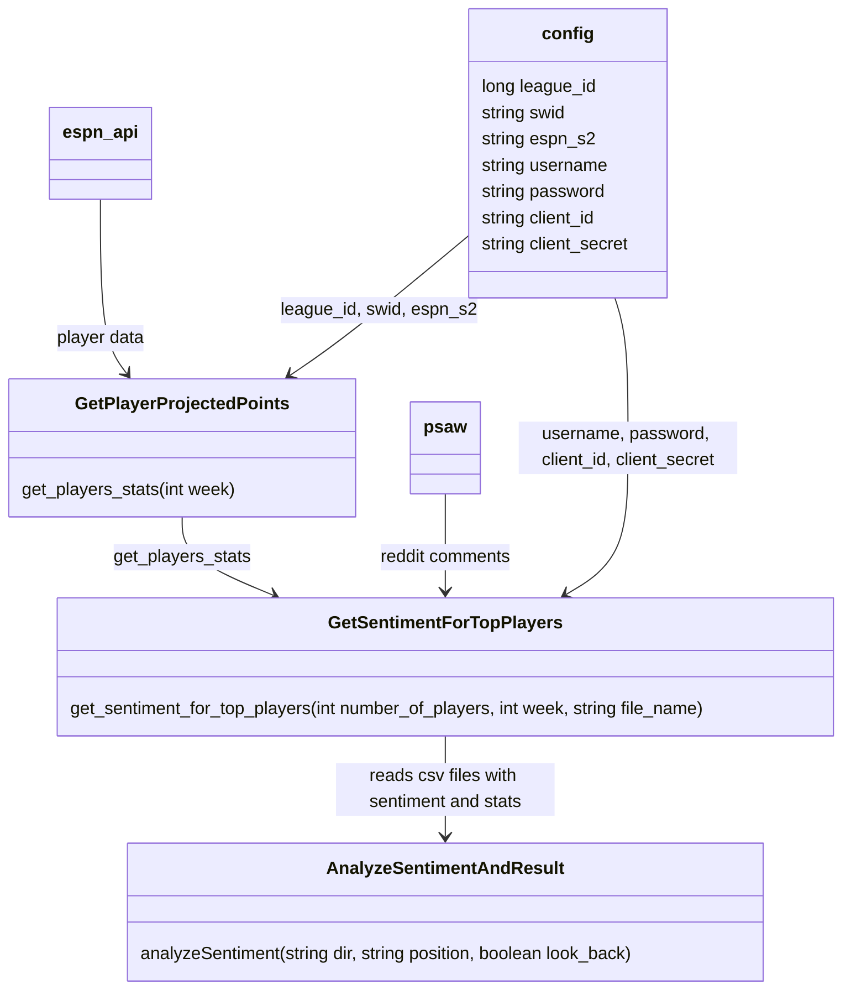

# WeHateFantasyFootball Fantasy Football Sentiment Analysis

Project Proposal: https://github.com/gerber55555/WeHateFantasyFootball/blob/f5eb44068b4e442189af47eea36f85900a060a2a/WeHateFantasyFootball%20Project%20Proposal.pdf 

Progress Report: https://github.com/gerber55555/WeHateFantasyFootball/blob/00cd7142d336f1f9f8aca4ebcd8a7b3ccea3de37/WeHateFantasyFootball%20Progress%20Report.pdf

#  Overview of the Project
This project attempts to measure the fan sentiment of NFL players and see how well it correlates with actual performance. To do so we use the reddit API to find posts about players in the league in the NFL subreddit, measure the sentiment, and then correlate it with fantasy football performance on the ESPN fantasy platform using their API. The goal is to see if there are undervalued players in the league whose sentiment is substantially lower than performance. These might be players that are worth attempting to trade for since fans view them negatively but their performance is still good.
# Team Member Contributions
* Ido Tamir (itamir2@illinois.edu): Wrote the code to calculate and analyze the sentiment for comments on reddit for each player.
* Christian Gerber (cgerber3@illinois.edu): Wrote the code to fetch player data from ESPN, setup reddit API, and created the web interface.

# Code Demo
https://www.youtube.com/watch?v=A6b-or4sCqk

# Architecture

# Code Documentation

## Pulling the Repo 

The first step of getting the code to run is cloning the repo
```
git clone https://github.com/gerber55555/WeHateFantasyFootball.git
```

Then navigate to the project directory to go from there
```
cd WeHateFantasyFootball
```

## Installation of Python Project

If you don't have Python installed. Install it here:  https://www.python.org/downloads/

Then install all the dependencies in the requirements file
```
 pip install -r Project/requirements.txt
```
Here are the packages and what they do:
### Espn Fantasy Football API
https://github.com/cwendt94/espn-api

The ESPN Fantasy Football API is what we use to get the football data from ESPN

The ESPN API Requires three values that can be gotten from your Fantasy Football league (TAs these are provided for you) and need to be set in config.py
* League ID
  * This value can be pulled straight from the url of your ESPN Fantasy Football League
* SWID and ESPN_2
  * These values can be pulled from the cookies in storage of your web browser after you have logged into ESPN Fantasy Football. For more context visit here: https://github.com/cwendt94/espn-api/discussions/150

### PRAW and PSAW
https://praw.readthedocs.io/en/stable/

https://psaw.readthedocs.io/en/latest/ 

PRAW and PSAW are the packages we use to pull reddit posts and comments into our code to have sentiment analysis performed on them

PRAW (Python Reddit API Wrapper) is the main package used to hook our code up to Reddit and PSAW (Python Pushshift.io API Wrapper) is the wrapper to help batch our requests (because we have thousands of them) to not get ratelimted by the Reddit API

PRAW Requires a Reddit account configured with developer options enabled and an app created on Reddit to get a Client ID and Client Secret. (TAs we have provided an already configured Reddit account for you)

Follow instructions on this page to enable those developer options and get the Client ID and Client Secret (again TAs we already configured this for you, no need to create one): https://medium.com/geekculture/how-to-extract-reddit-posts-for-an-nlp-project-56d121b260b4

### NLTK
https://www.nltk.org/

NLTK (Natural Language Toolkit) is the package we used to tokenize and perform sentiment analysis on the Reddit Comments

In NLTK we used the vader_lexicon (sentiment analysis lexicon) and punkt (sentence tokenizer) dependencies (these are automatically installed when running the code)

### pandas
https://pandas.pydata.org/docs/index.html

Pandas is the data analysis and manipulation tool we use to store and move data when it is doing sentiment analysis

### NumPy
https://numpy.org/

NumPy is the one of the tools we use to perform the analyzation of our results

### Scikit Learn (SkLearn)
https://scikit-learn.org/stable/

Scikit Learn is a package we use to perform some of the math in the analyzation in our results

### statsmodels
https://www.statsmodels.org/stable/index.html

Statsmodels is a package we use to perform some of the math in the analyzation in our results

### Matplotlib
https://matplotlib.org/

Matplotlib is a package we use to show the results of our math

## Installation of Web Project

First you need to install Node.js: https://nodejs.org/en/, just install the latest stable version. The version used for this project was `v18.12.0`


Next install the Angular CLI via the command line
```
npm install -g @angular/cli
```

On Windows computers the execution of PowerShell scripts is disabled by default. To allow the execution of PowerShell scripts, which is needed for npm global binaries, you must set the following
```
Set-ExecutionPolicy -Scope CurrentUser -ExecutionPolicy RemoteSigned
```
Carefully read the message displayed after executing the command and follow the instructions. Make sure you understand the implications of setting an execution policy.

Then to install the dependencies run
```
cd Project\WeHateFantasyFootballWebInterface
npm install
```
This will install the necessary dependencies for the web project. There is only one, Angular Materials

To view the web page run
```
ng serve --open
```
This will open the web page in your browser!

## How To Use

### Getting New Sentiment Data
If you want to get new sentiment data for new players you will want to use `GetSentimentForTopPlayers.py`

You will want to run the python script from command line (or whatever tool you prefer to use for running python scripts)

There are three arguments:
1. The first argument is the amount of players you want to get. It will get the top players (by player stats) from the ESPN API. Ten players would get the top ten players, 250 players would get you the top 250 players
2. The second argument is the week of football that you want to get stats from. The first week is the first week of the NFL season, not the first week of the year.
3. The third *optional* argument is the file name that you want the sentiment data saved to. If not provided, the file will be saved to the week number name (I.E. 1.csv)
```
python3 GetSentimentForTopPlayers.py <Number Of Players Required> <Week Number 1-18 Required> <filename Optional>

# Example

python3 GetSentimentForTopPlayers.py 250 3
```
Please note that depending on the amount of players you are pulling it could take several minutes to hours to complete data gathering and sentiment analysis

### Analyzing Sentiment Data
If you want to analyze the sentiment data that was fetched in the previous step, put all the csv files you generated in a single directory. Once the data is all in a single directory you will want to run `AnalyzeSentimentAndResult.py` . This file has 3 optional arguments:
1. The directory the data is in
2. A football position to filter by (QB, RB, WR, TE, K)
3. Whether you want to regress on this week’s score or last week’s score (to see if the sentiment was purely reactionary)

To see all these options run `AnalyzeSentimentAndResult.py --help` and it will print out the following:

```
usage: AnalyzeSentimentAndResult.py [-h] [-dd DIR] [-p POSITION] [-lb]

options:
  -h, --help            show this help message and exit
  -dd DIR, --data-directory DIR
                        directory the data is stored in
  -p POSITION, --position POSITION
                        optional position to filter by (QB, RB, WR, TE, K)
  -lb, --look-back      Look back one week and regress on last weeks score
```

Example Command:
`python3 AnalyzeSentimentAndResult.py -dd data -p RB -lb`
This will analyze only the data in `data` directory, that belongs to running backs and will regress on the scores from the previous week, where the input is the projected score and the sentiment

### Using the Webpage

The webpage is a nice way to view the results of the sentiment analysis. To view the players open the web page and scroll through the players

The webpage shows one week at a time, if you want to change the week, use the paginator in the bottom right corner to change the week!

If you want to add another week to the interface you have to drag it into the `assets` folder in the web project.

Then to update the paginator, (since Angular can't read the number of files in a directory) update the `length` variable in the code to the number of weeks you have. It must be named `<number>.csv` like the rest of them 